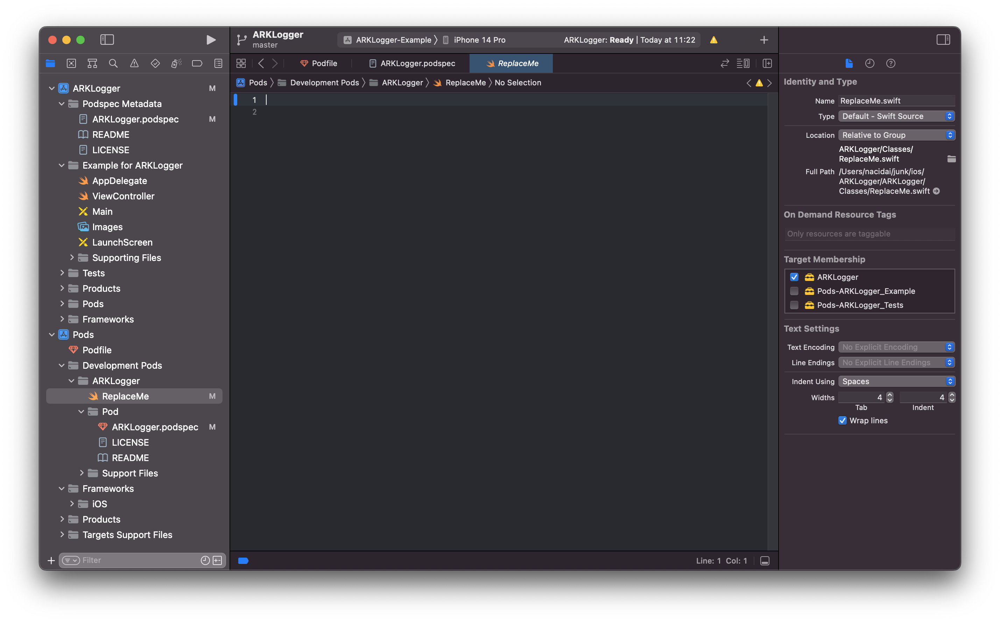
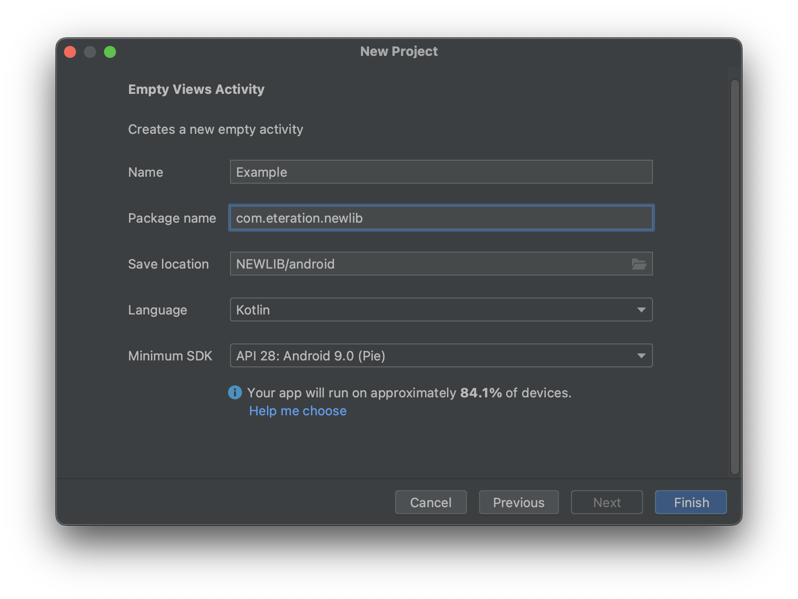
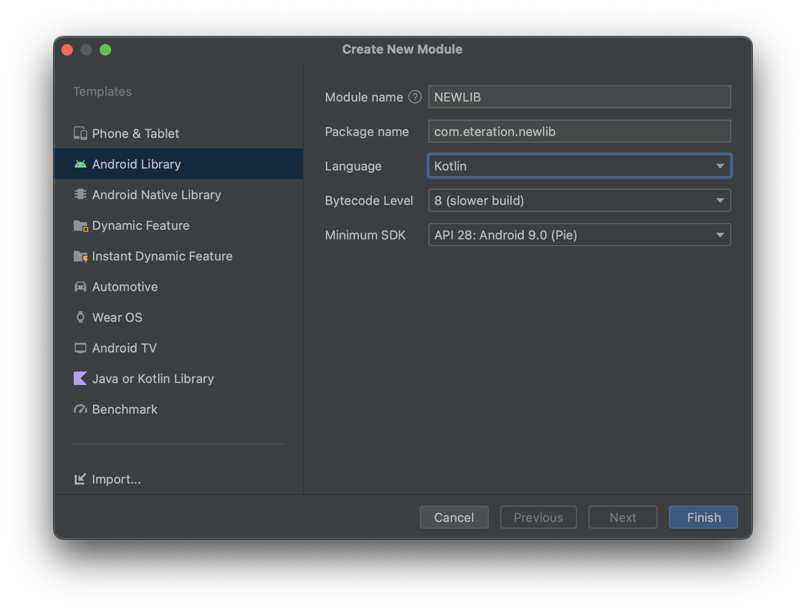

# The top level folder

```
  NEWLIB
      + android/
      + ios/
         + NEWLIB/
         + Example/
         + output/
      + reactnative/
         + src/
         + android/
         + ios/
      + docs/
      .gitignore
      README.md
```

# iOS Pod Library

Please follow the intsructions from "https://guides.cocoapods.org/making/using-pod-lib-create.html" to  create a new Pod library with and example IOS app inside the IOS folder as follows:

```sh

 mkdir -p NEWLIB/ios
 cd NEWLIB/ios
 pod lib create  NEWLIB

        What platform do you want to use?? [ iOS / macOS ]
        > iOS

        What language do you want to use?? [ Swift / ObjC ]
        > Swift

        Would you like to include a demo application with your library? [ Yes / No ]
        > Yes

        Which testing frameworks will you use? [ Quick / None ]
        > None

        Would you like to do view based testing? [ Yes / No ]
        > No
```

After the Pod is created you can start  off by opening your project in Xcode with:


```sh
   open 'NEWLIB/Example/NEWLIB.xcworkspace'
``````

## Editing the podspec

Edit the podspec file to set the target git repository swift version and 

```diff
#
# Be sure to run `pod lib lint NEWLIB.podspec' to ensure this is a
# valid spec before submitting.
#
# Any lines starting with a # are optional, but their use is encouraged
# To learn more about a Podspec see https://guides.cocoapods.org/syntax/podspec.html
#

Pod::Spec.new do |s|
  s.name             = 'NEWLIB'
  s.version          = '0.1.0'
  s.summary          = 'A short description of NEWLIB.'

# This description is used to generate tags and improve search results.
#   * Think: What does it do? Why did you write it? What is the focus?
#   * Try to keep it short, snappy and to the point.
#   * Write the description between the DESC delimiters below.
#   * Finally, don't worry about the indent, CocoaPods strips it!

  s.description      = <<-DESC
TODO: Add long description of the pod here.
                       DESC

-  s.homepage         = 'https://github.com/Naci Dai/NEWLIB'
+  s.homepage         = 'https://gitlab.eteration.com/NEWLIB'
  # s.screenshots     = 'www.example.com/screenshots_1', 'www.example.com/screenshots_2'
  s.license          = { :type => 'MIT', :file => 'LICENSE' }
  s.author           = { 'Naci Dai' => 'naci.dai@eteration.com' }
-  s.source           = { :git => 'https://github.com/Naci Dai/NEWLIB.git', :tag => s.version.to_s }
+  s.source           = { :git => 'https://gitlab.eteration.com/NEWLIB/ios/NEWLIB', :tag => s.version.to_s }
-  # s.social_media_url = 'https://twitter.com/<TWITTER_USERNAME>'

-  s.ios.deployment_target = '10.0'
+  s.ios.deployment_target = '12.0'
+  s.swift_versions = '5.0'

  s.source_files = 'NEWLIB/Classes/**/*'
  
  # s.resource_bundles = {
  #   'NEWLIB' => ['NEWLIB/Assets/*.png']
  # }

  # s.public_header_files = 'Pod/Classes/**/*.h'
  # s.frameworks = 'UIKit', 'MapKit'
  # s.dependency 'AFNetworking', '~> 2.3'
end

```


## Developing Swift Library

You will be able to scroll to Development Pods and edit the swift code to implement your library.  All new library code must be inside **NEWLIB/Classes/** folder. Delete the swift file named **ReplaceMe** and add your code.




##  Multiarchitecture Framework Podspec file (Device and Simulator)
At the same location as your Podspec file, copy the conents of the **NEWLIB.podspec** to **NEWLIB.podspec_Framework** and edit the contest as follows:

```diff
#
# Be sure to run `pod lib lint NEWLIB.podspec' to ensure this is a
# valid spec before submitting.
#
# Any lines starting with a # are optional, but their use is encouraged
# To learn more about a Podspec see https://guides.cocoapods.org/syntax/podspec.html
#

Pod::Spec.new do |s|
  s.name             = 'NEWLIB'
  s.version          = '0.1.0'
  s.summary          = 'A short description of NEWLIB.'

# This description is used to generate tags and improve search results.
#   * Think: What does it do? Why did you write it? What is the focus?
#   * Try to keep it short, snappy and to the point.
#   * Write the description between the DESC delimiters below.
#   * Finally, don't worry about the indent, CocoaPods strips it!

  s.description      = <<-DESC
TODO: Add long description of the pod here.
                       DESC

  s.homepage         = 'https://gitlab.eteration.com/NEWLIB'
  # s.screenshots     = 'www.example.com/screenshots_1', 'www.example.com/screenshots_2'
  s.license          = { :type => 'MIT', :file => 'LICENSE' }
  s.author           = { 'Naci Dai' => 'naci.dai@eteration.com' }
  s.source           = { :git => 'https://gitlab.eteration.com/NEWLIB/ios/NEWLIB', :tag => s.version.to_s }

  s.ios.deployment_target = '12.0'
  s.swift_versions = '5.0'

-  s.source_files = 'NEWLIB/Classes/**/*'
+  s.vendored_frameworks = "ArkWebView.xcframework"

  # s.resource_bundles = {
  #   'NEWLIB' => ['NEWLIB/Assets/*.png']
  # }

  # s.public_header_files = 'Pod/Classes/**/*.h'
  # s.frameworks = 'UIKit', 'MapKit'
  # s.dependency 'AFNetworking', '~> 2.3'
end

```


## Creating the Pod and publishing to the repository

Create a script to compile and create the multiarchitecture binaries from your library:

```bash
rm -rf output
mkdir -p output
cp NEWLIB.podspec_Framework output/NEWLIB.podspec
xcodebuild archive \
    -scheme NEWLIB \
    -destination "generic/platform=iOS" \
    -archivePath ./output/NEWLIB \
    SKIP_INSTALL=NO \
    BUILD_LIBRARY_FOR_DISTRIBUTION=YES

xcodebuild archive \
    -scheme NEWLIB \
    -destination "generic/platform=iOS Simulator" \
    -archivePath ./output/NEWLIB-Sim \
    SKIP_INSTALL=NO \
    BUILD_LIBRARY_FOR_DISTRIBUTION=YES

xcodebuild -create-xcframework \
    -framework ./output/NEWLIB.xcarchive/Products/Library/Frameworks/NEWLIB.framework \
    -framework ./output/NEWLIB-Sim.xcarchive/Products/Library/Frameworks/NEWLIB.framework \
    -output ./output/NEWLIB.xcframework
```

## Publishing the POD 
After running the script, the binaries are stored inside the output folder.  Yıu can publish the multiarchitecture Pod as the follows:
First you should check if the Podspec lints correctly, as you can't deploy with errors. This can be done with two methods, **pod lib lint** and **pod spec lint**. The difference between them is that **pod lib lint** does not access the network, whereas **pod spec lint** checks the external repo and associated tag.


If you're deploying to a private Specs repo, you will need to have already added that repo. See the guides on Private Specs Repos to set that up. If you are deploying to an existing Private Repo, use this command to deploy:

```sh
cd output
pod lib lint
pod spec lint
pod repo push SPEC_REPO *.podspec --verbose

```

pod repo push SPEC_REPO *.podspec --verbose


# android AAR library

Follow the (https://developer.android.com/studio/projects/android-library)[android-library] isntsructions to create and App named Example and a Library named NEWLIB. First create a new project named Example as **Empty Views Activity** and choose **NEWLIB/android** folder as the project location.



To create a new library module in your project, proceed as follows:

Click File > New > New Module.
In the Create New Module dialog that appears, click Android Library, then click Next.
There's also an option to create a Kotlin or Java library, which builds a traditional JAR file. While a JAR file is useful for many projects—especially when you want to share code with other platforms—it doesn't let you include Android resources or manifest files, which is very useful for code reuse in Android projects. This guide focuses on creating Android libraries.



Use your library in your Example App in the same project add a project-level dependency:

* Navigate to File > Project Structure > Dependencies.
* Select the module that you want to add the library.
* In the Declared Dependencies tab, click  and select Module Dependency from the menu.

At the end, it should change your application dependency in app/build.gradle as follows:

```diff
dependencies {

    implementation 'androidx.core:core-ktx:1.8.0'
    implementation 'androidx.appcompat:appcompat:1.6.1'
    implementation 'com.google.android.material:material:1.5.0'
    implementation 'androidx.constraintlayout:constraintlayout:2.1.4'
+    implementation project(path: ':NEWLIB')
    testImplementation 'junit:junit:4.13.2'
    androidTestImplementation 'androidx.test.ext:junit:1.1.5'
    androidTestImplementation 'androidx.test.espresso:espresso-core:3.5.1'
}
```

## Publishing the android AAR Library

Add the following to NEWLIB/build.gradle to publish the binary aar file as a Maven repo artifact

```diff 
filename: NEWLIB/build.gradle

+ afterEvaluate {
+     publishing {
+         publications {
+             release(MavenPublication) {
+                 from components.release
+ 
+                 groupId = 'com.eteration.NEWLIB'
+                 artifactId = 'NEWLIB'
+                 version = '0.1.0'
+             }
+         }
+     }
+ }
```

You can build and publish the aar file to your local manven trepository with the following:

```bash
./gradlew -p NEWLIB clean build publishToMavenLocal
```

#  React Native module

The final part of the library project creation is the setup fro the React Native Library module.  This library embed the native libraries from the previous sections and provides them as a Typescript library that can be installed with npm.  The seteup the library we will make use of the (**ccreate-react-native-library**)[https://github.com/callstack/react-native-builder-bob] tool. Create a new  library with an example reactnative app inside the reactnative folder as follows:

```sh

 cd NEWLIB
 npx create-react-native-library@latest  NEWLIB

Need to install the following packages:
  create-react-native-library@latest
Ok to proceed? (y) y
✔ What is the name of the npm package? … NEWLIB
✔ What is the description for the package? … NEWLIB Library
✔ What is the name of package author? … Eteration
✔ What is the email address for the package author? … info@eteration.com
✔ What is the URL for the package author? … https://eteration.com
✔ What is the URL for the repository? … https://gitlab.eteration.com/NEWLIB/reactnative
? What type of library do you want to develop? › - Use arrow-keys. Return to submit.
    JavaScript library
    Native module
    Native view
❯   Turbo module with backward compat - supports new arch (experimental)
    Turbo module
    Fabric view with backward compat
    Fabric view
? Which languages do you want to use? › - Use arrow-keys. Return to submit.
    Java & Objective-C
❯   Kotlin & Objective-C
    C++ for Android & iOS

# After the library creation is completed:

  mv NEWLIB to reactnative

```

You can now change into **reactnative/NEWLIB** folder and test the new reactnative library using the Example app as follows:

```bash

# Get started with the project:

  $ yarn  
or
  $ npm install  
 

# Run the example app on iOS:

  $ yarn example ios
or
  $ cd example 
  $ npm install  
  $ npm run ios  

# Run the example app on Android:

  $ yarn example android
or
  $ cd example 
  $ npm install  
  $ npm run android  
```

##  React Native android add dependency to  NEWLIB @aar library

The react native library is a wrapper for the NEWLIB to be used in reactnative apps.  It wıll reuse the libraries from the previos sections and create wrapper kotlin and swift classes to make them available to reactnative apps.  To add the android dependency as and aar (or to the original project module), open the **reactnative/android/build.gradle** :

```diff

filename: reactnative/android/build.gradle

dependencies {
  // For < 0.71, this will be from the local maven repo
  // For > 0.71, this will be replaced by `com.facebook.react:react-android:$version` by react gradle plugin
  //noinspection GradleDynamicVersion
  implementation "com.facebook.react:react-native:+"
  implementation "org.jetbrains.kotlin:kotlin-stdlib:$kotlin_version"
+ implementation "com.eteration.NEWLIB:NEWLIB:0.1.0@aar"
+  // OR DIRECTLY FROM THE LIB PROJECT implementation fileTree(dir: 'libs', include: ['*.aar', '*.jar'], exclude: [])
}

```

You can now implement the wrapper that embed our libbrary reactnative module and buidd and test it from the reactnative app as usual


##  React Native iOS add POD dependency to  NEWLIB Pod and Example App

The react native library is a wrapper for the NEWLIB to be used in reactnative apps.  It will reuse the libraries from the previos sections and create wrapper kotlin and swift classes to make them available to reactnative apps.  To add the iOS dependency as A  POD (or to the original project module), open the **reactnative/NEWLIB.podspec** and  **reactnative/example/ios/Podfile** :

```diff

filename: reactnative/NEWLIB.podspec

require "json"

package = JSON.parse(File.read(File.join(__dir__, "package.json")))
folly_compiler_flags = '-DFOLLY_NO_CONFIG -DFOLLY_MOBILE=1 -DFOLLY_USE_LIBCPP=1 -Wno-comma -Wno-shorten-64-to-32'

Pod::Spec.new do |s|
  s.name         = "NEWLIB"
  s.version      = package["version"]
  s.summary      = package["description"]
  s.homepage     = package["homepage"]
  s.license      = package["license"]
  s.authors      = package["author"]

  s.platforms    = { :ios => "11.0" }
  s.source       = { :git => "https://gitlab.eteration.com/NEWLIB.git", :tag => "#{s.version}" }

  s.source_files = "ios/**/*.{h,m,mm}"

  # Use install_modules_dependencies helper to install the dependencies if React Native version >=0.71.0.
  # See https://github.com/facebook/react-native/blob/febf6b7f33fdb4904669f99d795eba4c0f95d7bf/scripts/cocoapods/new_architecture.rb#L79.
  if respond_to?(:install_modules_dependencies, true)
    install_modules_dependencies(s)
  else
  s.dependency "React-Core"
+ s.dependency 'NEWLIB'

  # Don't install the dependencies when we run `pod install` in the old architecture.
  if ENV['RCT_NEW_ARCH_ENABLED'] == '1' then
    s.compiler_flags = folly_compiler_flags + " -DRCT_NEW_ARCH_ENABLED=1"
    s.pod_target_xcconfig    = {
        "HEADER_SEARCH_PATHS" => "\"$(PODS_ROOT)/boost\"",
        "OTHER_CPLUSPLUSFLAGS" => "-DFOLLY_NO_CONFIG -DFOLLY_MOBILE=1 -DFOLLY_USE_LIBCPP=1",
        "CLANG_CXX_LANGUAGE_STANDARD" => "c++17"
    }
    s.dependency "React-Codegen"
    s.dependency "RCT-Folly"
    s.dependency "RCTRequired"
    s.dependency "RCTTypeSafety"
    s.dependency "ReactCommon/turbomodule/core"
   end
  end    
end


```

and also in reactnative/example/ios APP open the **reactnative/example/ios/Podfile** :

```diff
file: reactnative/example/ios/Podfile

# Resolve react_native_pods.rb with node to allow for hoisting
require Pod::Executable.execute_command('node', ['-p',
  'require.resolve(
    "react-native/scripts/react_native_pods.rb",
    {paths: [process.argv[1]]},
  )', __dir__]).strip

platform :ios, min_ios_version_supported
prepare_react_native_project!

# If you are using a `react-native-flipper` your iOS build will fail when `NO_FLIPPER=1` is set.
# because `react-native-flipper` depends on (FlipperKit,...) that will be excluded
#
# To fix this you can also exclude `react-native-flipper` using a `react-native.config.js`
# ```js
# module.exports = {
#   dependencies: {
#     ...(process.env.NO_FLIPPER ? { 'react-native-flipper': { platforms: { ios: null } } } : {}),
# ```
flipper_config = ENV['NO_FLIPPER'] == "1" ? FlipperConfiguration.disabled : FlipperConfiguration.enabled

linkage = ENV['USE_FRAMEWORKS']
if linkage != nil
  Pod::UI.puts "Configuring Pod with #{linkage}ally linked Frameworks".green
  use_frameworks! :linkage => linkage.to_sym
end

target 'NEWLIBExample' do
  config = use_native_modules!

  # Flags change depending on the env values.
  flags = get_default_flags()

  use_react_native!(
    :path => config[:reactNativePath],
    # Hermes is now enabled by default. Disable by setting this flag to false.
    :hermes_enabled => flags[:hermes_enabled],
    :fabric_enabled => flags[:fabric_enabled],
    # Enables Flipper.
    #
    # Note that if you have use_frameworks! enabled, Flipper will not work and
    # you should disable the next line.
    :flipper_configuration => flipper_config,
    # An absolute path to your application root.
    :app_path => "#{Pod::Config.instance.installation_root}/.."
  )

+  pod 'NEWLIB', path: '../../../ios/ArkWebView'

  target 'NEWLIBExampleTests' do
    inherit! :complete
    # Pods for testing
  end

  post_install do |installer|
    # https://github.com/facebook/react-native/blob/main/packages/react-native/scripts/react_native_pods.rb#L197-L202
    react_native_post_install(
      installer,
      config[:reactNativePath],
      :mac_catalyst_enabled => false
    )
    __apply_Xcode_12_5_M1_post_install_workaround(installer)
  end
end


```

